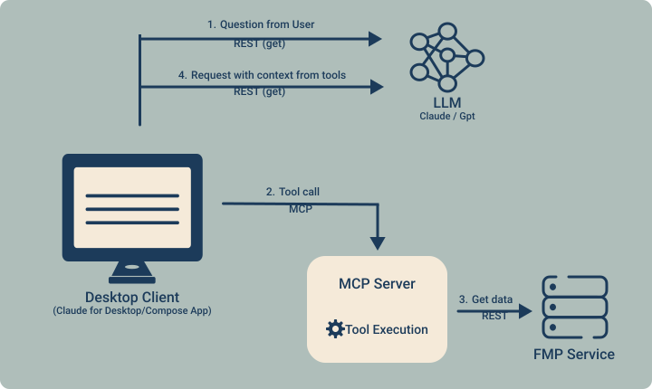
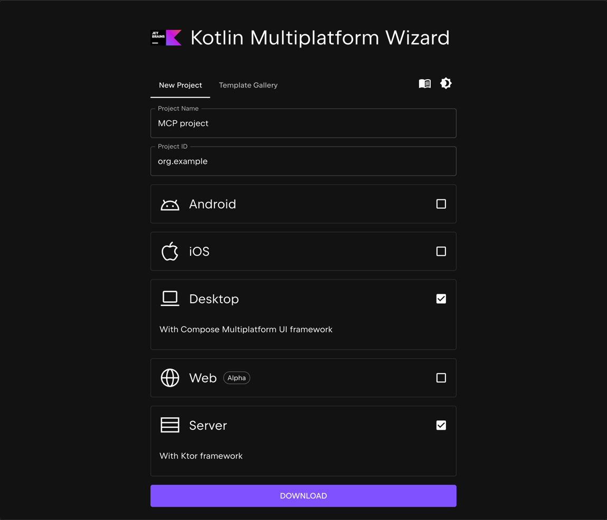
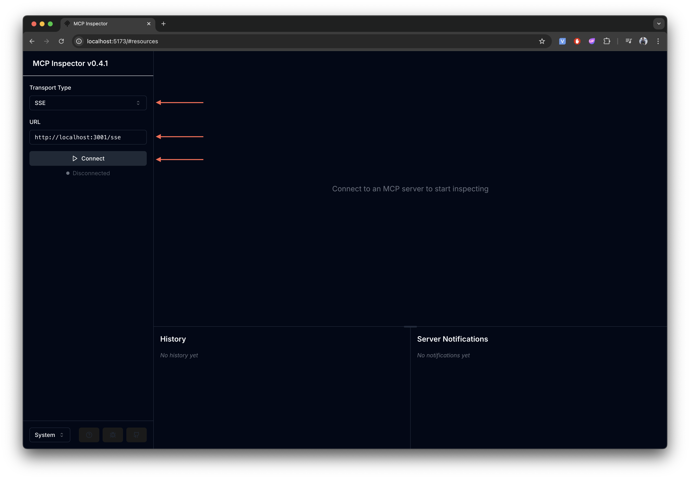
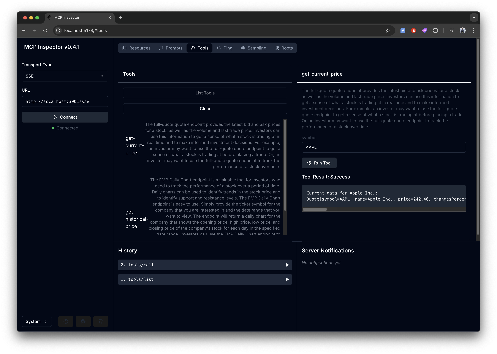

# MCP Kotlin SDK Tutorial

In this tutorial, we will explore the Model Context Protocol (MCP) with Kotlin in action. \
We will write an MCP server that will receive stock data from [Financial Modeling Prep (FMP)](https://site.financialmodelingprep.com/),
connect our server to Claude for Desktop, and then develop our own client using OpenAI and our server.

<p align="center">
  
  
</p>

> [!NOTE]
> We chose FMP because it demonstrates that models may not always have access to up-to-date financial data,
> such as stock quotes. Any other service can be used instead of FMP.


---

* [**Introduction**](#introduction) — brief explanation of MCP and overview of what will build
* [**Building the MCP Server**](#building-the-mcp-server) — developing the MCP server to fetch stock data from FMP
* [**Connecting to Claude for Desktop**](#3-claude-for-desktop) — integrating the MCP server with Claude for Desktop
* [**Client**](#4-client) — Creating a client using OpenAI

---

## Introduction

[**Model Context Protocol (MCP)**](https://modelcontextprotocol.io/introduction) is a protocol that allows external
tools (servers) to connect to LLMs (models like Claude or GPT), extending their capabilities by enabling:
- Fetching **Resources** from external sources (APIs, files, etc)
- Calling functions (**Tools**) that can be written in any language and perform useful actions
- Using predefined templates (**Prompts**) for structured interactions

Thus, MCP enhances the functionality of LLMs by providing them access to APIs and enabling arbitrary operations.

Below is a simple diagram illustrating what we weill build in this tutorial:



---

## Building the MCP Server

Let's implement MCP server with FMP, which can be used with Claude for Desktop or any other clients

In this section, we'll explore how to create a server that:
- **Provides tools** for performing specific tasks:
  - `get-current-price` — retrieves the current stock price
  - `get-historical-price` — fetches key stock metrics (_open_, _close_, _high_, _low_)
    by day starting from a specified date
- **Runs locally and is tested using MCP Inspector** to verify its functionality

### Requirements
- **_JDK 17_** or higher
- **_Gradle_**
- **_npx_** for testing with the MCP Inspector
- **_API key_** for retrieving data from [Financial Modeling Prep](https://site.financialmodelingprep.com/)
  
  > [!TIP]
  > You can get a free API key after registration, with a limit of **250 requests per day**.

### Plan 

Let's outline the general plan for creating an MCP server:

1. **Project initialization**
   - Create a project using web wizard or `gradle init`
   - Configure project
   - Add the necessary dependencies
2. **Define the tooling**
   - Create data classes for FMP
   - Implement functions for making REST request to FMP
3. **Server implementation**
   - Configure the server and integrate the tooling
   - Set up transport — in our case, it will be **_stdio_** and **_SSE_**
4. **Build and run**
5. **Manual testing with MCP Inspector**

### Set up the project

Since we will be developing both the server and the client using Compose, the easiest way to create project is by
using the [**Kotlin Multiplatform Wizard**](https://kmp.jetbrains.com/)



> [!NOTE]
> You can use any other Kotlin wizard to create the project or run `gradle init` and follow the instructions in the next steps.

In the generated project, we will need a **server module**. Let's configure it.

First, we need to add the following dependencies:
```kotlin
dependencies {
    implementation("io.modelcontextprotocol:kotlin-sdk:$mcp_kotlin_version") // mcp kotlin-sdk
    implementation("org.slf4j:slf4j-nop:$slf4j_version") // logging
}
```

Since we will be fetching data from FMP via REST, we need an **HTTP client** and a **serialization library** to handle JSON.

For this, we will use **Ktor** and **kotlinx-serialization**:
```kotlin
dependencies {
    implementation("io.ktor:ktor-client-core:$ktor_version")
    implementation("io.ktor:ktor-client-okhttp:$ktor_version")
    implementation("io.ktor:ktor-client-content-negotiation:$ktor_version")
    implementation("io.ktor:ktor-serialization-kotlinx-json:$ktor_version")
    implementation("io.ktor:ktor-client-logging:$ktor_version")
}
```

For kotlinx-serialization, need to add the following plugin:
```kotlin
plugins {
   kotlin("plugin.serialization") version kotlin_version
}
```

To build everything into a runnable JAR file, we need the Shadow plugin. Let’s configure it:

```kotlin
plugins {
    id("com.github.johnrengelman.shadow") version shadowJar_version
}

tasks.shadowJar {
   archiveFileName.set("serverAll.jar")
   archiveClassifier.set("")
   manifest {
      attributes["Main-Class"] = "org.example.MainKt"
   }
}
```

In the end, your Gradle build script will look something like this if you are using `gradle/libs.versions.toml`:

```kotlin
plugins {
   alias(libs.plugins.kotlinJvm) // Apply the Kotlin JVM plugin
   alias(libs.plugins.kotlin.serialization) // Apply Kotlinx Serialization
   alias(libs.plugins.shadow) // Apply the Shadow plugin for creating a fat JAR
   application // Mark this as an application project
}

repositories {
   mavenCentral() // Use Maven Central as the dependency repository
}

dependencies {
   implementation(libs.mcp.kotlin) // MCP Kotlin library
   implementation(libs.slf4j) // Logging with SLF4J
   implementation(libs.ktor.client.core) // Ktor core HTTP client
   implementation(libs.ktor.client.okhttp) // OkHttp engine for Ktor
   implementation(libs.ktor.client.content.negotation) // Content negotiation for serialization
   implementation(libs.ktor.client.serialization) // JSON serialization for Ktor
   implementation(libs.ktor.client.logging) // HTTP request/response logging
}

java {
   toolchain {
      languageVersion = JavaLanguageVersion.of(17) // Ensure Java 17+ is used
   }
}

application {
   mainClass = "io.github.devcrocod.example.MainKt" // Define the main entry point
}

tasks.shadowJar {
   archiveFileName.set("serverAll.jar") // Set the output JAR file name
   archiveClassifier.set("") // Ensure no additional classifier is added
   manifest {
      attributes["Main-Class"] = "io.github.devcrocod.example.MainKt" // Set the main class in the manifest
   }
}

tasks.named<Test>("test") {
   useJUnitPlatform() // Use JUnit Platform for unit tests.
}
```


### Building server

First, define data classes for handling responses from FMP.
In our case, we will be making requests to [`quote`](https://site.financialmodelingprep.com/developer/docs/stock-api)
and [`historical-price-full`](https://site.financialmodelingprep.com/developer/docs/daily-chart-charts)
to retrieve stock data and historical stock data, respectively.\
Let’s examine the responses and create the corresponding data classes,
annotating them with `@Serializable` to enable JSON deserialization into our classes:
```kotlin
// Response for the quote/symbol request
@Serializable
data class Quote(
   val symbol: String, // Stock symbol (e.g., AAPL, TSLA)
   val name: String, // Company name
   val price: Double, // Current stock price
   val changesPercentage: Double, // Percentage change in price
   val dayLow: Double, // Lowest price of the day
   val dayHigh: Double, // Highest price of the day
   val yearHigh: Double, // Highest price in the past year
   val yearLow: Double, // Lowest price in the past year
   val marketCap: Long, // Market capitalization
   val priceAvg50: Double, // 50-day average price
   val priceAvg200: Double, // 200-day average price
   val exchange: String, // Stock exchange name
   val volume: Long, // Trading volume
   val open: Double, // Opening price of the day
   val previousClose: Double, // Closing price from the previous day
   val eps: Double, // Earnings per share
   val pe: Double, // Price-to-earnings ratio
   val earningsAnnouncement: String, // Upcoming earnings announcement date
   val sharesOutstanding: Long, // Total number of outstanding shares
   val timestamp: Long // Data timestamp (UNIX format)
)

// Response for the historical-price-full/symbol request
@Serializable
data class HistoricalPrice(
   val symbol: String, // Stock symbol
   val historical: List<Historical> // List of historical stock data
)

@Serializable
data class Historical(
   val date: String, // Date of the record
   val open: Double, // Opening price on that day
   val high: Double, // Highest price on that day
   val low: Double, // Lowest price on that day
   val close: Double // Closing price on that day
)
```

The next step is to implement the requests to FMP to fetch the stock data.\
For this, we will use Ktor’s `HttpClient` and write two extension functions:

```kotlin
/**
 * Retrieves the current price of a stock
 *
 * @param symbol The stock ticker symbol or financial instrument identifier for which to fetch the price.
 * @return A [Quote] object containing the details of the financial instrument's current price, or null if the request is unsuccessful or the symbol is invalid.
 */
suspend fun HttpClient.getCurrentPrice(symbol: String): Quote? {
    val response = this.get("quote/${symbol.uppercase()}") {
        parameter("apikey", fmpApiKey)
    }.takeIf { it.status == HttpStatusCode.OK } ?: run {
        System.err.println("Failed to retrieve data for $symbol")
        null
    }

    return response?.body<List<Quote>>()?.firstOrNull()
}

/**
 * Fetches the historical price data for a given stock
 *
 * @param symbol The stock ticker symbol of the financial asset to retrieve historical price data for.
 * @param from An optional parameter specifying the start date of the historical data range in YYYY-MM-DD format.
 * @param to An optional parameter specifying the end date of the historical data range in YYYY-MM-DD format.
 * @return A [HistoricalPrice] object containing the historical price data for the specified symbol, or null if the data could not be retrieved.
 */
suspend fun HttpClient.getHistoricalPrice(symbol: String, from: String? = null, to: String? = null): HistoricalPrice? {
   val response = this.get("historical-price-full/${symbol.uppercase()}") {
      url {
         with(parameters) {
            from?.let { append("from", it) }
            to?.let { append("to", it) }
            append("apikey", fmpApiKey)
         }
      }
   }.takeIf { it.status == HttpStatusCode.OK } ?: run {
      System.err.println("Failed to retrieve data for $symbol")
      null
   }

   return response?.body<HistoricalPrice>()
}
```

You’ll need an API key for FMP here.
You can get a free API key after registration, add it to your environment variables, and use it in your code: 
```kotlin
private val fmpApiKey = System.getenv("FMP_API_KEY") ?: error("FMP_API_KEY environment variable is not set")
```

Once we have our functions, we can add them as tools to our MCP server.\
Let’s configure the server:

```kotlin
fun configureServer(): Server {
    val def = CompletableDeferred<Unit>()
   
    val httpClient = HttpClient {
        ... // Define our HttpClient for interacting with FMP
    }

    // Initialize the server
    val server = Server(
        Implementation(
            name = "mcp-kotlin Financial Modeling Prep server",
            version = "1.0.0"
        ),
        ServerOptions(
            capabilities = ServerCapabilities(
                prompts = ServerCapabilities.Prompts(listChanged = true),
                resources = ServerCapabilities.Resources(subscribe = true, listChanged = true),
                tools = ServerCapabilities.Tools(listChanged = true)
            )
        )
    ) { def.complete(Unit) }

   //  Add the tool
    server.addTool(
        name = , // Tool name
        description = , // Tool description. This provides the necessary context for the LLM about what the tool does.
        inputSchema = , // Function input schema
    ) { request ->
        ... // Tool execution logic
    }

    return server
}
```

Adding our two functions as Tools:

```kotlin
    // Add the tool for the `getCurrentPrice` function
    server.addTool(
        name = "get-current-price",
        description = """
            The full-quote quote endpoint provides the latest bid and ask prices for a stock,
            as well as the volume and last trade price.
            Investors can use this information to get a sense of what a stock is trading at in real time and to make informed investment decisions.
            
            For example, an investor may want to use the full-quote quote endpoint to get a sense of what a stock is trading at before placing a trade.
            Or, an investor may want to use the full-quote quote endpoint to track the performance of a stock over time.
        """.trimIndent(),
        inputSchema = Tool.Input(
            properties = JsonObject(mapOf("symbol" to JsonPrimitive("string"))),
            required = listOf("symbol")
        )
    ) { request ->
        val symbol = request.arguments["symbol"] // Retrieve the symbol
        if (symbol == null) {
            return@addTool CallToolResult(
                content = listOf(TextContent("The 'symbol' parameter is required."))
            )
        }
       // Call getCurrentPrice with the retrieved symbol
        val price = httpClient.getCurrentPrice(symbol.jsonPrimitive.content) 
        if (price != null) { // If a result is available, return it as text
            CallToolResult(
                content = listOf(
                    TextContent(
                        """
                            Current data for ${price.name}:
                            $price
                        """.trimIndent()
                    )
                )
            )
        } else { // Otherwise, indicate that no data was found
            CallToolResult(
                content = listOf(TextContent("Failed to retrieve data for $symbol"))
            )
        }
    }

    // Add the tool for the `getHistoricalPrice` function 
    server.addTool(
        name = "get-historical-price",
        description = """
            The FMP Daily Chart endpoint is a valuable tool for investors who need to track the performance of a stock over a period of time.
            Daily charts can be used to identify trends in the stock price and to identify support and resistance levels.
            The FMP Daily Chart endpoint is easy to use.
            Simply provide the ticker symbol for the company that you are interested in and the date range that you want to view.
            The endpoint will return a daily chart for the company that shows the opening price, high price, low price,
            and closing price of the company's stock for each day in the specified date range.
            Investors can use the FMP Daily Chart endpoint to identify trends in the stock price by looking for patterns in the chart.
            
            For example, an investor might look for stocks that are in an uptrend or a downtrend.
            Investors can also use the FMP Daily Chart endpoint to identify support and resistance levels.
        """.trimIndent(),
        inputSchema = Tool.Input(
            properties = JsonObject(
                mapOf(
                    "symbol" to JsonPrimitive("string"),
                    "from" to JsonPrimitive("date"),
                    "to" to JsonPrimitive("date"),
                )
            ),
            required = listOf("symbol")
        )
    ) { request ->
        val symbol = request.arguments["symbol"]
        val from = request.arguments["from"]?.jsonPrimitive?.contentOrNull
        val to = request.arguments["to"]?.jsonPrimitive?.contentOrNull
        if (symbol == null) {
            return@addTool CallToolResult(
                content = listOf(TextContent("The 'symbol' parameter is required."))
            )
        }
        val price = httpClient.getHistoricalPrice(symbol.jsonPrimitive.content, from, to)
        if (price != null) {
            CallToolResult(
                content = listOf(
                    TextContent(
                        """
                            Historical data for ${price.symbol}:
                            ${price.historical}
                        """.trimIndent()
                    ),
                )
            )
        } else {
            CallToolResult(
                content = listOf(TextContent("Failed to retrieve data for $symbol"))
            )
        }
    }
```

Now, define how our server will interact. We will implement two options:
- **stdio** transport
- **SSE** transport

```kotlin
/**
 * Runs an MCP (Model Context Protocol) server using standard I/O for communication.
 *
 * This function initializes a server instance configured with predefined tools and capabilities.
 * It sets up a transport mechanism using standard input and output for communication.
 * Once the server starts, it listens for incoming connections, processes requests,
 * and executes the appropriate tools. The server shuts down gracefully upon receiving
 * a close event.
 */
fun `run mcp server using stdio`() {
    val server = configureServer()
    val transport = StdioServerTransport(
        System.`in`.asInput(),
        System.out.asSink().buffered()
    )

    runBlocking {
        server.connect(transport)
        val done = Job()
        server.onCloseCallback = {
            done.complete()
        }
        done.join()
    }
}

/**
 * Launches an SSE (Server-Sent Events) MCP (Model Context Protocol) server on the specified port.
 * This server enables clients to connect via SSE for real-time communication and provides endpoints
 * for handling specific messages.
 *
 * @param port The port number on which the SSE server should be started.
 */
fun `run sse mcp server`(port: Int): Unit = runBlocking {
    val servers = ConcurrentMap<String, Server>()

    val server = configureServer()
    embeddedServer(CIO, host = "0.0.0.0", port = port) {
        install(SSE)
        routing {
            sse("/sse") {
                val transport = SSEServerTransport("/message", this)

                servers[transport.sessionId] = server

                server.onCloseCallback = {
                    servers.remove(transport.sessionId)
                }

                server.connect(transport)
            }
            post("/message") {
                val sessionId: String = call.request.queryParameters["sessionId"]!!
                val transport = servers[sessionId]?.transport as? SSEServerTransport
                if (transport == null) {
                    call.respond("Session not found", null)
                    return@post
                }

                transport.handlePostMessage(call)
            }
        }
    }.start(wait = true)
}
```

Finally, let’s implement the initialization and startup of our server:
```kotlin
/**
 * Entry point.
 * It initializes and runs the appropriate server mode based on the input arguments.
 *
 * Command-line arguments passed to the application:
 * - args[0]: Specifies the server mode. Supported values are:
 *      - "--sse-server": Runs the SSE MCP server.
 *      - "--stdio": Runs the MCP server using standard input/output.
 *      Defaults to "--sse-server" if not provided.
 * - args[1]: Specifies the port number for the server. Defaults to 3001 if not provided or invalid.
 */
fun main(args: Array<String>) {
    val command = args.firstOrNull() ?: "--sse-server"
    val port = args.getOrNull(1)?.toIntOrNull() ?: 3001
    when (command) {
        "--sse-server" -> `run sse mcp server`(port)
        "--stdio" -> `run mcp server using stdio`()
        else -> {
            System.err.println("Unknown command: $command")
        }
    }
}
```

### Testing

To start our server, you can use the GUI option in your IDE or run the following command in the terminal:

```shell
./gradlew server:run
```

Once the server starts, it will be available at `http://localhost:3001/sse` or another specified port.

Now, let’s use this to verify that our MCP server is working.
For this, we need to use the [MCP Inspector](https://modelcontextprotocol.io/docs/tools/inspector) utility.

You can install and run the inspector using `npx`:
```shell
npx @modelcontextprotocol/inspector <command>
```

If the inspector is not installed, the first run will prompt you to confirm the installation.\
Alternatively, you can pass the `-y` option to automatically confirm the installation.


In `<command>`, specify the command to launch our server, such as: `java path/to/jar/file --args`\
Or you can start the inspector and manually connect it to our server.
Since we already launched the server, let’s do just that:

```shell
npx @modelcontextprotocol/inspector
```

You will see in the terminal that the inspector has started and is available at a certain address.\
It should look something like this:

```text
Starting MCP inspector...
Proxy server listening on port 3000

🔍 MCP Inspector is up and running at http://localhost:5173 🚀
```

Your port may be different.\
Now, let’s open the inspector in any browser and test our MCP server!

To connect to the running service, select **SSE** as the **transport type** and enter the server **URL**.
Then, click **Connect**.



Once connected:
1. Go to the **Tools** tab
2.	Click **List Tools** — this will retrieve the available tools on the MCP server
3.	Select `get-current-price`
4.	Once you select the tool, you will see its description and input fields for arguments on the right side
5.	Since this tool requires a single argument (`symbol`), enter a stock ticker such as **`AAPL`**
6.	You will receive the result of the request execution



Similarly, you can test the other tool, `get-historical-price`.

---
