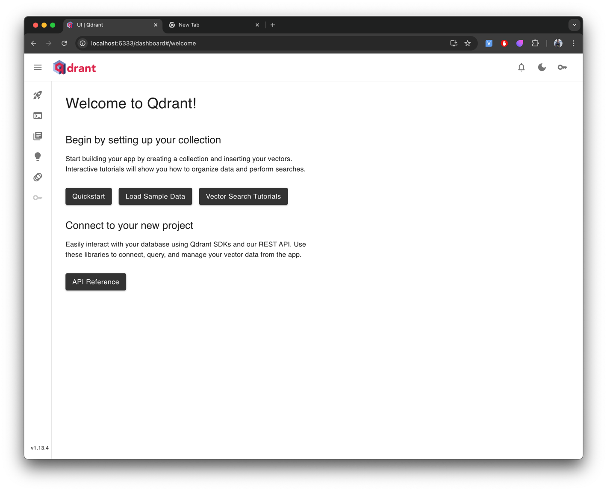
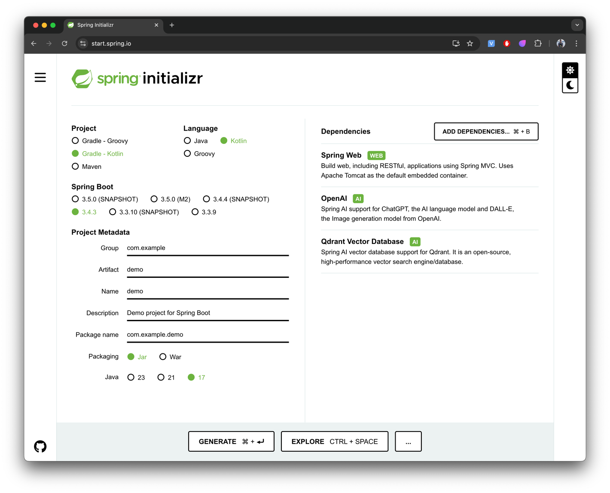
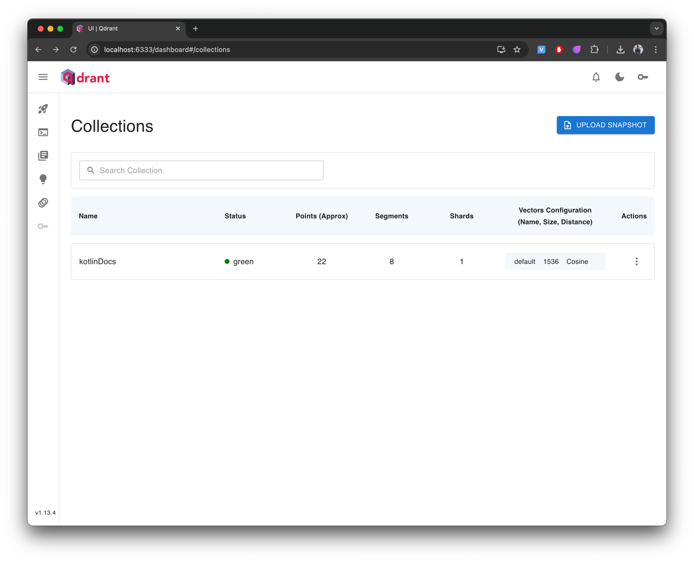
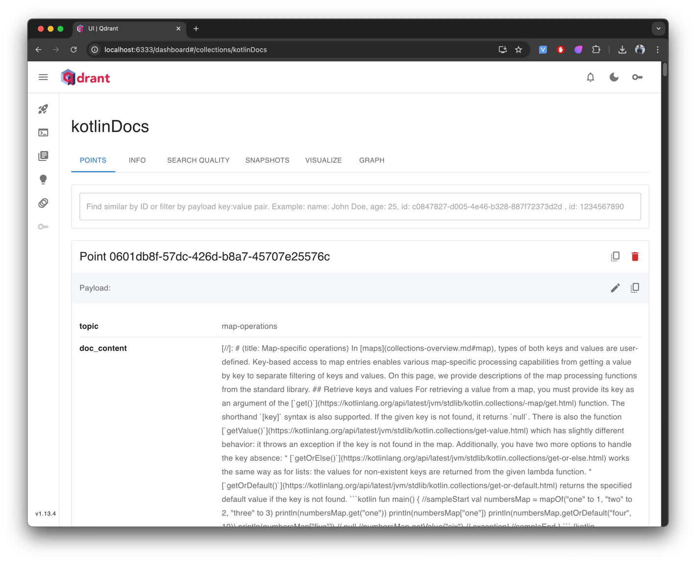

# Get started with Spring AI and Kotlin

This tutorial will show you how to create a Spring Boot application using RAG and a vector store with Spring AI.

In this tutorial, you will learn how to:

1. Create a Spring AI project
2. Load documents into the vector store
3. Use RAG to get a relevant answer

---

## Create a Spring AI project

For this tutorial, you will need the following:

- An API key from an LLM provider (we will use OpenAI)
- Docker for the vector store (we will use Qdrant)
- Project initialization

### Create OpenAI key

### Create an OpenAI Key

Create an API key on the [OpenAI platform](https://platform.openai.com/api-keys) that you will use to access the API.
Once you’ve generated an API key, export it as an environment variable in your terminal:

[macOS, Linux]

```shell
export OPENAI_API_KEY="your_api_key_here"
```

[Windows]

```shell
setx OPENAI_API_KEY "your_api_key_here"
```

> [!WARNING]
> The OpenAI API is a paid service. You can check the pricing [here](https://platform.openai.com/docs/pricing)
>
> You can use any [other LLM provider](https://docs.spring.io/spring-ai/reference/1.0/api/chatmodel.html).

### Install Docker and run Qdrant

To install Docker, visit the [Get Docker page](https://docs.docker.com/get-started/get-docker/),
select your operating system, and follow the installation instructions.

For the vector store, we will use [Qdrant](https://qdrant.tech/documentation/overview/).

After installing Docker, open your terminal and run the following command to start the container:

```shell
docker run -p 6333:6333 -p 6334:6334 qdrant/qdrant
```

We have mapped two ports: 6333 is used for accessing the dashboard,
and 6334 is used for interaction with the Spring application.

After startup, you will see the relevant information in the terminal, and you can open the dashboard:



### Project Initialization

Create a new Spring Boot project with Spring AI and Kotlin using [start.spring.io](https://start.spring.io/).

Select the following:

- **Project**
    - Gradle - Kotlin
- **Language**
    - Kotlin
- **Spring Boot**
    - latest stable version (3.4.3)
- **Packaging**
    - Jar
- **Java**
    - 17
- **Dependencies**
    - Spring Web
    - OpenAI
    - Qdrant Vector Database



Your final **build.gradle.kts** file should look approximately like this:

```kotlin
plugins {
	kotlin("jvm") version "2.2.21"
	kotlin("plugin.spring") version "2.2.21"
	id("org.springframework.boot") version "3.5.0"
	id("io.spring.dependency-management") version "1.1.7"
}

group = "com.example"
version = "0.0.1-SNAPSHOT"

java {
	toolchain {
		languageVersion = JavaLanguageVersion.of(17)
	}
}

repositories {
	mavenCentral()
}

val springAiVersion = "1.0.0"

dependencyManagement {
	imports {
		mavenBom("org.springframework.ai:spring-ai-bom:$springAiVersion")
	}
}

dependencies {
	implementation("org.springframework.boot:spring-boot-starter-web")
	implementation("com.fasterxml.jackson.module:jackson-module-kotlin")
	implementation("org.jetbrains.kotlin:kotlin-reflect")
	implementation("org.springframework.ai:spring-ai-starter-model-openai")
	implementation("org.springframework.ai:spring-ai-starter-vector-store-qdrant")
	implementation("org.springframework.ai:spring-ai-advisors-vector-store")

	testImplementation("org.springframework.boot:spring-boot-starter-test")
	testImplementation("org.jetbrains.kotlin:kotlin-test-junit5")
	testRuntimeOnly("org.junit.platform:junit-platform-launcher")
}

kotlin {
	compilerOptions {
		freeCompilerArgs.addAll("-Xjsr305=strict")
	}
}

tasks.withType<Test> {
	useJUnitPlatform()
}
```

Click **Generate** — your project will be downloaded.
Open it in your IDE (e.g., IntelliJ IDEA).

In the opened project, set the required properties in
**[src/mian/resources/application.properties](src/main/resources/application.properties)**:

```properties
# OpenAI
spring.ai.openai.api-key=${OPENAI_API_KEY}
spring.ai.openai.chat.options.model=gpt-4o-mini
spring.ai.openai.embedding.options.model=text-embedding-ada-002
# Qdrant
spring.ai.vectorstore.qdrant.host=localhost
spring.ai.vectorstore.qdrant.port=6334
spring.ai.vectorstore.qdrant.collection-name=kotlinDocs
spring.ai.vectorstore.qdrant.initialize-schema=true
```

If you run the Spring application and navigate to the Qdrant dashboard
([localhost:6333/dashboard](http://localhost:6333/dashboard)),
you will see an empty collection of documents created:


---

## Add documents to the vector store

After creating and configuring the project, we can inject and use the VectorStore.
Let’s create a Controller that will load documents into the vector store and add a simple similarity search.
We will retrieve documents from the Kotlin standard library and load them into our vector store.
We will also add a similarity search to retrieve documents based on a query.

```kotlin
@RestController
@RequestMapping("/kotlin")
class KotlinSTDController(
  private val restTemplate: RestTemplate,
  private val vectorStore: VectorStore,
) {
  private val logger = LoggerFactory.getLogger(this::class.java)

  @OptIn(ExperimentalUuidApi::class)
  @PostMapping("/load-docs")
  fun load() {
    // List of topics to load from the Kotlin website documentation.
    val kotlinStdTopics = listOf(
      "collections-overview", "constructing-collections", "iterators", "ranges", "sequences",
      "collection-operations", "collection-transformations", "collection-filtering", "collection-plus-minus",
      "collection-grouping", "collection-parts", "collection-elements", "collection-ordering",
      "collection-aggregate", "collection-write", "list-operations", "set-operations",
      "map-operations", "read-standard-input", "opt-in-requirements", "scope-functions", "time-measurement",
    )
    // Base URL for the documents.
    val url = "https://raw.githubusercontent.com/JetBrains/kotlin-web-site/refs/heads/master/docs/topics/"
    // Retrieve each document from the URL and add it to the vector store.
    kotlinStdTopics.forEach { topic ->
      val data = restTemplate.getForObject("$url$topic.md", String::class.java)
      data?.let { it ->
        val doc = Document.builder()
          // Build a Document with a random UUID, the text content, and metadata.
          .id(Uuid.random().toString())
          .text(it)
          .metadata("topic", topic)
          .build()
        vectorStore.add(listOf(doc))
        logger.info("Document $topic loaded.")
      } ?: logger.warn("Failed to load document for topic: $topic")
    }
  }

  @GetMapping("docs")
  fun query(
    @RequestParam query: String = "operations, filtering, and transformations",
    @RequestParam topK: Int = 2
  ): List<Document>? {
    val searchRequest = SearchRequest.builder()
      .query(query)
      .topK(topK)
      .build()
    val results = vectorStore.similaritySearch(searchRequest)
    logger.info("Found ${results?.size ?: 0} documents for query: '$query'")
    return results
  }
}
```

After starting the Spring application and calling the endpoint **_POST /kotlin/load-docs_**:

```shell
curl -X POST http://localhost:8080/kotlin/load-docs
```

you should see that 22 documents have been loaded into the vector store.



You can also view the details of each document.



We can call **_GET /docs_** to get the top n documents for a query. Let’s use the default:

```shell
curl -X GET http://localhost:8080/kotlin/docs     
```

As a result, you will see something like the following:

```json
[
  {
    "id": "8d21abc5-a918-469e-98e6-97f79369fb4d",
    "text": "[//]: # (title: Collection operations overview)\n\nThe Kotlin standard library offers a broad variety of ...",
    "media": null,
    "metadata": {
      "distance": 0.23725575,
      "topic": "collection-operations"
    },
    "score": 0.7627442479133606
  },
  {
    "id": "5c8bb8e4-ff5d-4247-8639-0cddcff7c93f",
    "text": "[//]: # (title: Collection transformation operations)\n\nThe Kotlin standard library provides a set of ...",
    "media": null,
    "metadata": {
      "distance": 0.24700677,
      "topic": "collection-transformations"
    },
    "score": 0.7529932260513306
  }
]
```

---

## Implement a RAG-Powered Chat Endpoint

Once the documents are loaded,
the next step is to implement an endpoint that returns a relevant answer to a query based on the documents.
For this, we will use the `RetrievalAugmentationAdvisor`, which provides an out-of-the-box RAG implementation.
We will use the `RewriteQueryTransformer` to rewrite the user’s query.

First, let’s create a simple data class for the request:

```kotlin
data class ChatRequest(val query: String, val topK: Int = 3)
```

Next, implement the endpoint:

```kotlin
@RestController
@RequestMapping("/kotlin")
class KotlinSTDController(
  private val chatClientBuilder: ChatClient.Builder,
  private val restTemplate: RestTemplate,
  private val vectorStore: VectorStore,
) {
  private val logger = LoggerFactory.getLogger(this::class.java)
  private val chatClient = chatClientBuilder.defaultAdvisors(SimpleLoggerAdvisor()).build()

  @PostMapping("/chat/ask")
  fun chatAsk(@RequestBody request: ChatRequest): String? {
    // Define the prompt template with placeholders {query} and {target}.
    val promptTemplate = PromptTemplate(
      """
            {query}.
            Please provide a concise answer based on the "Kotlin standard library" documentation.
        """.trimIndent()
    )

    // Create the prompt by substituting placeholders with actual values.
    val prompt: Prompt =
      promptTemplate.create(mapOf("query" to request.query))

    // Configure the retrieval advisor to augment the query with relevant documents.
    val retrievalAdvisor = QuestionAnswerAdvisor.builder(vectorStore)
      .searchRequest(
        SearchRequest.builder()
          .similarityThreshold(0.7)
          .topK(request.topK)
          .build()
      )
      .promptTemplate(promptTemplate)
      .build()

    // Send the prompt to the LLM with the retrieval advisor and get the response.
    val response = chatClient.prompt(prompt)
      .advisors(retrievalAdvisor)
      .call()
      .content()
    logger.info("Chat response generated for query: '${request.query}'")
    return response
  }
}
```

And now you can send a question via **_POST /kotlin/chat/ask_**:

```shell
curl -X POST "http://localhost:8080/kotlin/chat/ask" \
     -H "Content-Type: application/json" \
     -d '{"query": "What are the performance implications of using lazy sequences in Kotlin for large datasets?", "topK": 3}'
```

and receive a relevant answer:

```text
Using lazy sequences in Kotlin for large datasets can improve performance by avoiding the creation of intermediate
collections during multi-step processing. This lazy evaluation means that elements are processed one-by-one, allowing
for potentially reduced memory usage and faster execution times, especially when only a subset of the data is needed.
However, the lazy nature of sequences may introduce some overhead, which can be significant for smaller collections or
simpler computations. Therefore, it's important to consider the specific use case to determine whether sequences or
collections are more efficient
```

---

## Conclusion

In this tutorial, we demonstrated how to build a Spring Boot application with Spring AI and Kotlin. We loaded Kotlin
standard library documents into a Qdrant vector store, implemented endpoints for similarity search and a RAG-powered
chat interface, and integrated an LLM to provide detailed answers based on documentation. This project lays a solid
foundation for building intelligent, document-driven applications.